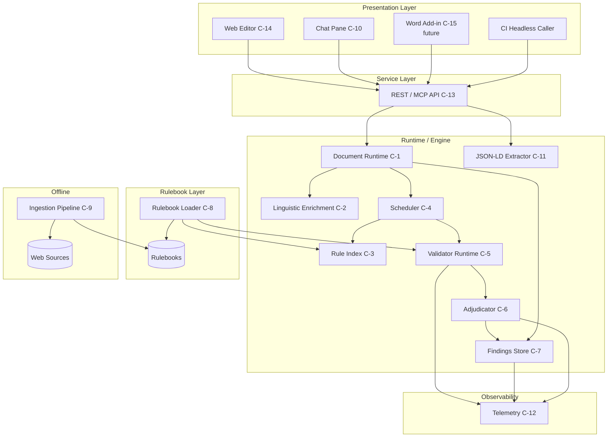
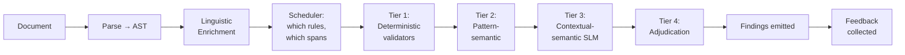
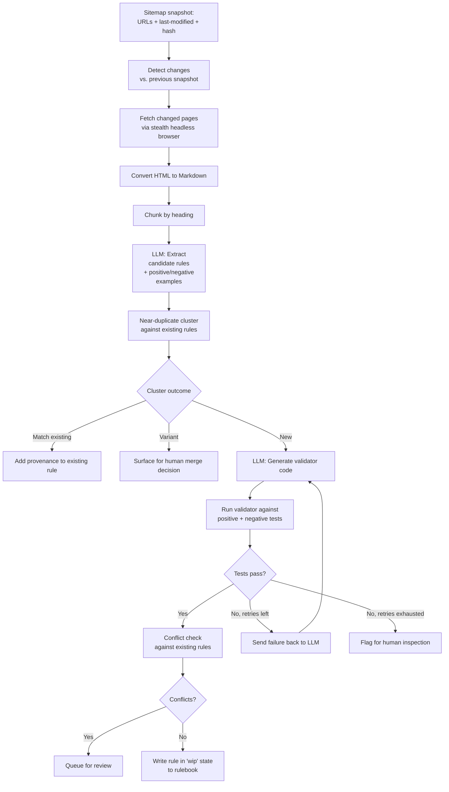

# Octavius v2 — Functional Requirements & Technical Specification

> **Status:** Draft 0.1 · Hybrid FRD / Tech Spec
> **Audience:** Engineering, product, and architectural reviewers
> **Author:** Tom (with Claude)
> **Repository:** TBD (candidate for fresh repository, see §13)

---

## 0. Document Control

| Item | Value |
|------|-------|
| Document type | Hybrid Functional Requirements Document (FRD) and Technical Specification |
| Supersedes | Octavius v1 architecture (six-phase GitHub Actions linting pipeline) |
| Conventions | `MUST`, `SHOULD`, `MAY` per RFC 2119. Functional requirements identified by `FR-*`. Non-functional by `NFR-*`. Open questions by `OQ-*`. |
| Reference implementations | Named technologies (Tiptap, spaCy, Selenium, Render, etc.) are **reference implementations** unless explicitly marked `MUST USE`. The architecture is specified in terms of capabilities; concrete tools may be substituted provided the capability contract is preserved. |

---

## 1. Purpose, Scope, and Audience

### 1.1 Purpose

Octavius v2 is a complete architectural rewrite of the Octavius style-compliance system. It replaces the existing batch linter with a **document runtime** that supports interactive editing, headless validation, generative composition, and structured-data extraction, while maintaining strict separation between the runtime, the rule engine, and the presentation layer.

The system enforces style guidance — beginning with the Australian Government Style Manual — but is designed so that any organisation can extend, override, or replace the rulebook without modifying the runtime.

### 1.2 In scope

- Canonical document representation independent of UI.
- Rule engine with a deterministic-first, semantically-augmented validation pipeline.
- Web editor (interactive) and API (headless) entry points.
- Self-bootstrapping rule ingestion from web sources.
- Generative composition middleware (chat surface that enforces style on LLM output).
- JSON-LD extraction.
- Per-rule and per-user telemetry, feedback, and suppression.
- Pluggable rulebooks and per-document profile selection.

### 1.3 Out of scope (initially)

- Microsoft Word add-in (desirable; deferred — see §13).
- GovCMS plugin (desirable; deferred).
- Multi-user real-time collaboration on a single document.
- Long-term storage of customer documents (the runtime is designed to be **stateless with respect to document content** wherever feasible).
- Translation, intent rewriting, or any rule class identified as "intent/rhetorical" in §9.2.

### 1.4 Audience

Engineers building or reviewing the system; product owners assessing scope and risk; integrators evaluating the system as middleware. The document assumes familiarity with web architectures, NLP basics, and style-checking tools (Vale, Hemingway, Grammarly).

---

## 2. Glossary

| Term | Definition |
|------|------------|
| **AST** | Abstract Syntax Tree. The structured representation of a document's nodes (paragraphs, headings, lists, marks, etc.). |
| **Adjudicator** | A model or component that resolves ambiguous or contextual cases that deterministic rules cannot decide. Typically an SLM or LLM. |
| **Document Runtime** | The headless, UI-independent core that parses, holds, validates, and serialises documents. |
| **Finding** | A single instance of a rule firing against a span of content, with explanation and (optionally) a remediation suggestion. |
| **Profile** | A user- or document-level selection (e.g., "formal correspondence", "social media") that determines which rules in the active rulebook(s) are eligible to run. |
| **Rule** | A single executable unit of style guidance, conforming to the contract in §6. |
| **Rulebook** | A versioned, queryable collection of rules and tests, conforming to the contract in §7. |
| **Selector** | The mechanism by which a rule declares the spans it applies to (analogous to a CSS selector but operating over the AST plus linguistic annotations). |
| **SLM** | Small Language Model. A compact transformer used for contextual semantic adjudication where deterministic rules are insufficient. |
| **Span** | A contiguous range of content within the document, typically anchored to a stable node identifier plus character offsets. |
| **Suppression** | A user action that prevents a specific finding (instance) or all findings from a rule (forever) from being shown again. Recorded as feedback. |
| **Validator** | The executable component that, given a span and a rule, produces zero or more findings. A rule may have one or more validators. |

---

## 3. Vision and Design Principles

### 3.1 Vision

A pragmatic, transparent style-compliance system that:

1. Is **predictable** — most of what it does is deterministic and explainable.
2. Is **extensible** — organisations own their rulebooks; the runtime is neutral.
3. Is **honest about uncertainty** — when a rule depends on judgement, the system says so and shows its working.
4. Is **embeddable** — the same engine drives a web editor, a CI check, a chat middleware, and a future Word plugin.
5. Is **cheap to run** — semantic models are used where they earn their cost, not by default.

### 3.2 Design principles

| Principle | Consequence |
|-----------|-------------|
| **Runtime / UI separation** | All validation and document operations are exposed by the runtime. UIs are presentation. |
| **Deterministic first** | A finding produced by deterministic logic is preferred to a model-generated one of equal severity. Models are used to reduce false positives, never to manufacture authority. |
| **Stable identity** | Content nodes carry stable identifiers across edits wherever the editor permits. Findings, suppressions, and partial revalidation all depend on this. |
| **Capability over implementation** | Architectural components are specified by their capability contract; the implementation is replaceable. |
| **Fail visible, never silent** | Rules in unknown states, ingestion failures, conversion losses, and unmapped JSON-LD content are surfaced, not hidden. |
| **Provenance everywhere** | Every rule, every finding, and every model decision is traceable to a source. |
| **Graceful degradation** | If a model component is unavailable, deterministic rules continue. If the editor crashes, the runtime keeps state recoverable. |

---

## 4. Functional Requirements

Requirements are grouped by capability area. Each requirement is uniquely identified for traceability (§ Appendix D).

### 4.1 Document Runtime

| ID | Requirement | Priority |
|----|-------------|----------|
| FR-RT-01 | The system **MUST** maintain a canonical document representation that is independent of any specific user interface. | Must |
| FR-RT-02 | The runtime **MUST** expose a programmatic API for parsing, validating, transforming, and serialising documents. | Must |
| FR-RT-03 | The runtime **MUST** assign stable identifiers to content nodes and **MUST** preserve those identifiers across edits where the editing operation does not destroy the node's identity (e.g., a paragraph being edited retains its ID; a paragraph being deleted does not). | Must |
| FR-RT-04 | The runtime **MUST** support partial revalidation: when content changes, only the rules whose scope of validity intersects the change **SHOULD** be re-executed. | Must |
| FR-RT-05 | The runtime **MUST** support round-tripping content into and out of Microsoft Word with preservation of structural formatting (headings, lists, emphasis, basic tables). Lossy conversions **MUST** be reported, not silently dropped. | Must |
| FR-RT-06 | The runtime **MUST** be capable of operating without persisting document content beyond the lifetime of a single request, to support stateless deployment. | Must |
| FR-RT-07 | The runtime **SHOULD** expose document operations as a versioned API (semver) so that integrators can pin to a contract. | Should |

**Capability summary.** The runtime is the source of truth for document state. It owns the AST, the node-identity strategy, the linguistic enrichment cache, and the validation orchestration. Every other component — editor, API, chat middleware, JSON-LD extractor — is a consumer of the runtime.

**Reference implementation.** Tiptap (built on ProseMirror) for the editor binding; ProseMirror's schema and transaction model as the AST and edit log; UUIDv7 stamped onto each block-level node and persisted as a node attribute. The runtime is a Node.js (or TypeScript) library; the editor and the API both link against it in-process where possible to avoid serialisation overhead.

### 4.2 Rule Engine and Validation Pipeline

| ID | Requirement | Priority |
|----|-------------|----------|
| FR-EN-01 | The engine **MUST** apply rules only to spans for which the rule has declared relevance (per §6). | Must |
| FR-EN-02 | The engine **MUST** support a tiered validation pipeline: deterministic → pattern-semantic → contextual-semantic → adjudicative. Each tier is optional per rule. | Must |
| FR-EN-03 | The engine **MUST** produce structured findings conforming to the finding schema (§6.4). | Must |
| FR-EN-04 | The engine **MUST** be able to execute synchronously (low-latency, single-document) and asynchronously (batch, headless, queued). | Must |
| FR-EN-05 | The engine **MUST** support per-instance suppression and "ignore forever" suppression, both recorded as feedback (§4.8). | Must |
| FR-EN-06 | The engine **MUST** produce, where feasible, a remediation suggestion alongside each finding. | Must |
| FR-EN-07 | The engine **MUST** declare for each finding whether the underlying rule is deterministic or probabilistic, and **MUST** surface the confidence band for probabilistic findings. | Must |
| FR-EN-08 | The engine **MUST** resolve precedence, exclusion, and dependency relationships between rules before emitting findings (§9.4). | Must |
| FR-EN-09 | The engine **SHOULD** cache rule outcomes keyed by `(rule_id@version, node_id, node_content_hash)` so that unchanged content is not re-validated. | Should |
| FR-EN-10 | The engine **MUST** be able to batch contextual-semantic and adjudicative model calls within a single validation pass to amortise model latency and cost. | Must |

**Capability summary.** The engine takes (a) an enriched document AST and (b) an active rulebook subset, and produces findings. It owns the scheduler (which rules to run, where, and in what order), the validator runtime, the cache, and the adjudication logic. It is deliberately separable from the runtime so that a CI worker can run the engine over a serialised AST without instantiating an editor.

**Reference implementation.** Engine in TypeScript; deterministic validators as pure functions over AST + linguistic annotations; pattern-semantic validators using cached embeddings (e.g., `bge-base-en-v1.5` already used in Tripwire); contextual-semantic validators using a small hosted model (configurable; could be Bedrock, OpenAI, or self-hosted Ollama).

### 4.3 Rule Authoring and Ingestion

| ID | Requirement | Priority |
|----|-------------|----------|
| FR-IN-01 | The system **MUST** support authoring rules manually via the rule contract (§6). | Must |
| FR-IN-02 | The system **MUST** support semi-automated ingestion of rules from web-published style guides, producing draft rules in the `Not built` or `WIP` state for human review. | Must |
| FR-IN-03 | The ingestion subsystem **MUST** maintain a snapshot index of source pages (URL, last-modified, content hash, retrieval timestamp) to detect upstream change. | Must |
| FR-IN-04 | The ingestion subsystem **MUST** generate, for each candidate rule, both positive examples (text that should violate the rule) and negative examples (text that should not), and **MUST** generate executable validator code that is tested against those examples before promotion. | Must |
| FR-IN-05 | Validator code that fails its own generated tests **MUST** be returned to the generation step a configurable number of times; persistent failure **MUST** flag the rule for human inspection. | Must |
| FR-IN-06 | The ingestion subsystem **MUST** detect candidate-rule similarity to existing rules (duplicates and near-duplicates) and surface clusters for human adjudication (see OQ-01). | Must |
| FR-IN-07 | The ingestion subsystem **MUST** detect candidate rules that conflict with existing rules and queue them for review (see OQ-03). | Must |
| FR-IN-08 | All rules — manual or ingested — **MUST** progress through the rule lifecycle states (§6.5) and **MUST** carry full provenance metadata. | Must |

**Capability summary.** Ingestion is a pipeline, not a feature of the runtime. It produces rule artifacts that are written into a rulebook. It is run on a schedule (or on demand) and is independent of the live system.

**Reference implementation.** Headless-browser scraping for JavaScript-rendered style guides (reference: Selenium with stealth options, or Playwright); HTML-to-Markdown conversion (reference: `markdownify`); chunking by heading; LLM batch jobs for rule extraction, example generation, and validator code generation; deterministic test runner; near-duplicate clustering on rule-statement embeddings; conflict detection by running new positive examples against the existing rule set. Orchestration via GitHub Actions, consistent with the rest of the IPAVentures pipeline ecosystem.

### 4.4 User Interface (Web)

| ID | Requirement | Priority |
|----|-------------|----------|
| FR-UI-01 | The web interface **MUST** present a rich-text editor backed by the document runtime, with live (or near-live) display of findings. | Must |
| FR-UI-02 | The user **MUST** be able to select a writing profile (e.g., formal correspondence, standard, social media) that scopes which rules run. | Must |
| FR-UI-03 | The user **MUST** be able to suppress an individual finding ("dismiss this instance") or a rule entirely ("ignore forever for me"). Both actions are recorded as feedback. | Must |
| FR-UI-04 | The user **MUST** be able to accept a suggested remediation, which applies the suggestion to the document. | Must |
| FR-UI-05 | The interface **MUST** provide a "Correct all suggestions" action that applies all currently-shown remediations of severity ≤ a configurable threshold, with an undo option. | Must |
| FR-UI-06 | The interface **MUST** support light and dark themes. | Must |
| FR-UI-07 | User preferences (theme, profile, per-rule overrides) **MUST** be cached client-side and **MUST** be retrievable as a portable settings export. | Must |
| FR-UI-08 | The interface **MUST** support paste-from-Word and copy-to-Word with formatting preservation (per FR-RT-05). | Must |
| FR-UI-09 | Power users **MUST** be able to enable, disable, or override individual rules within their active profile. | Must |
| FR-UI-10 | The interface **SHOULD** display a reading-level metric for the active document (reference: Flesch-Kincaid, equivalent to Hemingway). | Should |
| FR-UI-11 | The interface **SHOULD** include spellcheck, **SHOULD** support an Australian English dictionary, and **MUST** allow user dictionary additions. | Should |

**Capability summary.** The UI is a thin presentation layer over the runtime API. It does not duplicate validation logic. Findings are rendered as inline annotations with hover/click affordances.

**Reference implementation.** React (functional components, hooks); Tiptap editor; runtime accessed via in-process binding (when bundled) or REST/WebSocket (when remote). Settings stored in `localStorage` with a JSON-export endpoint.

### 4.5 Headless Operation, API, and Integrations

| ID | Requirement | Priority |
|----|-------------|----------|
| FR-API-01 | The system **MUST** expose a REST (or REST-like) API that supports validating a document and returning findings, without requiring the web UI. | Must |
| FR-API-02 | The API **MUST** accept documents in at least: the canonical AST format, Markdown, and a documented subset of HTML. | Must |
| FR-API-03 | The API **MUST** be deployable as a single-process, self-contained service suitable for free-tier hosting (current target: Render). | Must |
| FR-API-04 | The system **MUST** support on-premises deployment via a container image with no required external services beyond the configured model providers. | Must |
| FR-API-05 | The system **SHOULD** expose an MCP server interface so it can be invoked by agentic systems as a tool. | Should |
| FR-API-06 | The API **MUST** authenticate requests; HTTP Basic Auth is acceptable for v1; token-based auth **SHOULD** be supported. | Must |
| FR-API-07 | The API **MUST** return findings in a stable, documented JSON schema versioned independently of the rule schema. | Must |

**Capability summary.** The headless surface allows Octavius to act as middleware in a larger pipeline (e.g., validating LLM output before it reaches a downstream consumer; gating CI for documentation repositories).

**Reference implementation.** Express or Fastify on Node.js; deployed as a single Render web service with `DATA_ROOT` for any persistent state, mirroring the Tripwire Dashboard pattern. Container image published to GHCR for on-prem.

### 4.6 Generative Composition Middleware (LLM Chat)

| ID | Requirement | Priority |
|----|-------------|----------|
| FR-GC-01 | The system **MUST** offer a chat surface in which the user prompts an LLM and receives a response that has been validated against the active style profile. | Must |
| FR-GC-02 | When the LLM response produces findings, the system **MUST** present those findings to the user alongside the response and **MUST** offer to regenerate the response with the findings as constraints. | Must |
| FR-GC-03 | The middleware **MUST** support multiple LLM providers behind a unified interface; the active provider is configurable per deployment. | Must |
| FR-GC-04 | The middleware **MUST** budget retries (default: at most one regeneration attempt per turn) to bound cost and latency. After exhaustion, the response is shown with findings unresolved and the user decides. | Must |
| FR-GC-05 | The system **MUST NOT** silently rewrite LLM output; any modification beyond the LLM's own regeneration **MUST** be presented to the user for accept/reject. | Must |

**Capability summary.** The chat is a separate surface that uses the same runtime and engine as the editor. It does not reimplement validation. It does add a constrained-regeneration loop with strict bounds.

**Reference implementation.** Provider-neutral LLM client (e.g., a thin facade over Anthropic, OpenAI, Bedrock); the runtime's existing validation API; chat UI as a second pane in the React app or a standalone view.

### 4.7 JSON-LD Generation

| ID | Requirement | Priority |
|----|-------------|----------|
| FR-LD-01 | The system **MUST** be able to generate JSON-LD from authored content. | Must |
| FR-LD-02 | The system **MUST** propose a template (schema.org type) based on document characteristics, and **MUST** allow the user to override the proposed template. | Must |
| FR-LD-03 | The system **MUST** present the user with a short series of focused questions to resolve fields that cannot be deterministically extracted. | Must |
| FR-LD-04 | Population of the JSON-LD template from content **MUST** be deterministic; any field that cannot be filled deterministically **MUST** be either resolved by user question or left blank with a clear marker. | Must |
| FR-LD-05 | The system **MUST** highlight any source content that did not map to any JSON-LD field, so the user can confirm nothing important was dropped. | Must |
| FR-LD-06 | Generated JSON-LD **MUST** be validated against the schema.org definition of its `@type` and **MUST** fail loudly if invalid. | Must |
| FR-LD-07 | Extracted metadata **MUST** be presented in a user-friendly editable view; the user **MUST** be able to amend any field before export. | Must |
| FR-LD-08 | The JSON-LD subsystem **MUST** support multiple `@type` values within a document (e.g., `Article` containing `FAQPage` blocks), consistent with prior IPFR JSON-LD work. | Must |

**Capability summary.** JSON-LD generation is a structured-data extraction subsystem layered over the same canonical AST. It does not validate prose style; it complements it.

**Reference implementation.** Templates as JSON-LD documents with placeholder slots and `extractor:` annotations; deterministic extractors (regex, AST walks, lookup tables) populate slots; an LLM may optionally suggest a template but does not populate fields directly. JSON-LD validation via `pyld` or equivalent.

### 4.8 Performance and Feedback Telemetry

| ID | Requirement | Priority |
|----|-------------|----------|
| FR-FB-01 | The system **MUST** record, per rule, how often it fires across the user base. | Must |
| FR-FB-02 | The system **MUST** allow users to flag a finding as a false positive, with an optional comment. | Must |
| FR-FB-03 | The system **MUST** measure end-to-end validation latency, broken down by pipeline tier. | Must |
| FR-FB-04 | The system **MUST** record ignored/dismissed findings (per-instance and forever) and **MUST** distinguish between "ignored once" and "ignored permanently". | Must |
| FR-FB-05 | Telemetry **MUST** be collected in a manner consistent with the deployment context's privacy posture; on-prem deployments **MUST** be able to disable any external telemetry transmission. | Must |
| FR-FB-06 | The system **SHOULD** expose a dashboard view of rule-level metrics for rulebook maintainers. | Should |

**Capability summary.** Feedback closes the loop between users and rule authors. Rules with high ignore rates are candidates for review; rules with high accept rates on remediations are candidates for promotion to higher confidence.

**Reference implementation.** Append-only event log (JSONL) per deployment; for shared-tenant deployments, aggregated nightly to a SQLite/Parquet metrics store consistent with Tripwire's storage idioms.

### 4.9 Configuration, Profiles, and Custom Rulebooks

| ID | Requirement | Priority |
|----|-------------|----------|
| FR-CF-01 | The system **MUST** allow organisations to load custom rulebooks alongside, or in place of, the default. | Must |
| FR-CF-02 | A custom rulebook **MUST** be loadable without modification to the runtime or engine code. | Must |
| FR-CF-03 | When multiple rulebooks are active, the system **MUST** apply the precedence rules declared at the rulebook level (default: explicit organisational rulebook overrides default rulebook for any conflict). | Must |
| FR-CF-04 | Profiles (`formal correspondence`, `standard`, `social`, custom) **MUST** be defined as named subsets of the active rulebooks plus any per-profile severity overrides. | Must |
| FR-CF-05 | Profile and rulebook configuration **MUST** be expressible as version-controlled text files (no GUI-only configuration). | Must |
| FR-CF-06 | The system **SHOULD** support per-document profile overrides via document-front-matter or API parameter. | Should |

**Capability summary.** Configuration is the seam through which Octavius becomes useful to organisations beyond its origin context. The rule schema is the contract; everything above it is configurable.

**Reference implementation.** Rulebook as a directory of YAML rule manifests with co-located validator code (TypeScript or Python depending on validator implementation). Profiles as YAML files referencing rule IDs and overrides.

---

## 5. Non-Functional Requirements

| ID | Requirement | Priority |
|----|-------------|----------|
| NFR-PERF-01 | Interactive validation latency for a 5,000-word document on the default rulebook **SHOULD** be ≤ 2 seconds for the deterministic tier and ≤ 8 seconds for the full pipeline. | Should |
| NFR-PERF-02 | Partial revalidation triggered by a single-paragraph edit **SHOULD** complete in ≤ 500 ms for the deterministic tier. | Should |
| NFR-PERF-03 | The system **MUST** be able to process a 100-document batch headlessly without OOM on a 1 GB-RAM Render instance, where each document is ≤ 10,000 words. (May be achieved by streaming.) | Must |
| NFR-COST-01 | The default deployment **SHOULD** be runnable on Render's free tier or equivalent. | Should |
| NFR-COST-02 | Per-document model spend (contextual + adjudicative tiers combined) **SHOULD** be predictable and disclosed; budget caps **MUST** be enforceable per-deployment. | Should |
| NFR-A11Y-01 | The web interface **MUST** meet WCAG 2.1 AA for the editor and findings panel. Findings **MUST** be reachable by keyboard. | Must |
| NFR-A11Y-02 | The system **SHOULD** support adding WCAG-derived rules to the default rulebook (e.g., heading-level discipline, alt-text presence). The cost of adding such rules is bounded by the rule contract. | Should |
| NFR-SEC-01 | Document content **MUST NOT** be transmitted to any model provider not explicitly configured for the deployment. | Must |
| NFR-SEC-02 | Rulebooks loaded from disk **MUST** be validated against the rulebook schema before being used; malformed rulebooks **MUST** be rejected with a clear error rather than silently degraded. | Must |
| NFR-SEC-03 | Validator code (when expressed as executable code rather than declarative patterns) **MUST** run in a constrained context: no network access, no filesystem access outside its declared scope. | Must |
| NFR-MAINT-01 | All public APIs (runtime, engine, REST) **MUST** be semver-versioned with a documented deprecation policy. | Must |
| NFR-MAINT-02 | The default rulebook **MUST** carry a changelog generated from per-rule patch notes (§7). | Must |
| NFR-PORT-01 | The runtime and engine **MUST** be runnable in Node.js ≥ 20 LTS. Browser execution of a deterministic-only subset **SHOULD** be possible to enable client-side preview. | Must |
| NFR-OBS-01 | All rule executions, model calls, cache hits/misses, and pipeline-tier transitions **MUST** be observable via structured logs and **SHOULD** be exportable as OpenTelemetry traces. | Must |

---

## 6. Rule Contract

A rule is the atomic unit of style guidance. The contract below is normative.

### 6.1 Schema (informative summary)

A rule is a structured object with the following fields. A normative JSON Schema is given in Appendix A.

| Field | Cardinality | Notes |
|-------|-------------|-------|
| `id` | required, unique | URN-style stable identifier, e.g., `rule:agsm/voice/active-voice` |
| `version` | required | Semantic version. Major = contract-breaking; minor = scope/selector change; patch = test, explanation, or remediation change. |
| `title` | required | Short human-readable name. |
| `provenance` | required | See §6.2. |
| `state` | required | One of: `not_built`, `disabled`, `wip`, `experimental`, `under_review`, `operational`. See §6.5. |
| `relevance` | required | Selector(s) declaring where the rule applies. See §6.3. |
| `non_relevance` | optional | Negative selector(s) excluding spans even if `relevance` matched. |
| `relationships` | optional | Declarations of `precedence`, `excludes`, `requires`, `composes_with`, `supersedes` against other rule IDs. |
| `validators` | required, ≥ 1 | One or more validator declarations. See §6.6. |
| `determinism` | required | `deterministic` or `probabilistic`. Probabilistic rules **MUST** declare a `confidence` field with each finding. |
| `severity` | required | One of: `info`, `style`, `warning`, `error`, `critical`. May be overridden at the profile level. |
| `explanation` | required | Template (with placeholders for span content) for the user-facing explanation. |
| `remediation` | optional | Either a deterministic transform, a templated suggestion, or a generator function declaration. |
| `scheduling` | optional | Hints to the scheduler: `cost_class` (`cheap`, `medium`, `expensive`), `batchable`, `scope` (`local`, `neighborhood`, `document`). |
| `rulebook` | required | Foreign key to the containing rulebook (denormalised for portability). |
| `tests` | required | Positive examples (must fire), negative examples (must not fire), edge cases. |

### 6.2 Provenance

Provenance is a structured record indicating where the rule originated:

```yaml
provenance:
  source: "Australian Government Style Manual"
  source_url: "https://www.stylemanual.gov.au/..."
  retrieved_at: "2026-04-15T10:00:00Z"
  retrieved_by: "ingest:agsm-pipeline@v0.3"
  source_section: "Voice and tone > Active voice"
  source_text_hash: "sha256:..."
  ingestion_method: "automated"  # or "manual", "imported"
  reviewed_by: "tom@..."          # populated when state advances past WIP
  reviewed_at: "..."
```

Provenance is **append-only**: subsequent reviews and revisions add entries; nothing is overwritten.

### 6.3 Relevance and selectors

Relevance is declared as one or more selector expressions. A selector matches a span if all of its conditions hold:

| Dimension | Examples |
|-----------|----------|
| AST node type | `paragraph`, `heading[level=1]`, `list_item`, `link`, `code_block` |
| Linguistic features (POS, dependency, NER) | `pos=PROPN`, `dep=nsubj`, `entity=ORG` |
| Content class | `contains_acronym`, `contains_number`, `is_question` |
| Document profile | `profile in {formal, standard}` |
| Document-level features | `language=en-AU`, `audience=general` |

Selectors are composable (AND/OR). The reverse index (§9.3) is built from these declarations: rules are indexed by their selector predicates so that, given a span, the engine can look up applicable rules in O(rules-matching-this-span) rather than O(rules-total).

Negative selectors (`non_relevance`) are evaluated after positive matches and exclude the span. Common patterns: "not in code blocks", "not in block quotes", "not in headings".

### 6.4 Findings

A finding is the structured output when a rule fires. Schema:

```yaml
finding_id: "uuid"
rule_id: "rule:agsm/voice/active-voice"
rule_version: "1.2.0"
node_id: "uuidv7-of-node"
span:
  start_offset: 42
  end_offset: 71
  excerpt: "...the report was reviewed by..."
severity: "warning"
determinism: "deterministic"     # or "probabilistic"
confidence: null                 # required when probabilistic
explanation: "Passive voice. Consider using active voice for clearer authorship."
remediation:
  available: true
  type: "templated"              # or "deterministic_transform" | "generative"
  suggestion: "...the team reviewed the report..."
provenance:
  validators_run: ["pattern:passive-voice-v1", "slm:active-voice-adjudicator"]
  pipeline_tier: "contextual_semantic"
emitted_at: "2026-05-10T..."
```

The `provenance.validators_run` field exposes which validators contributed to this finding, supporting the "explain its findings" requirement.

### 6.5 Rule lifecycle

```
   not_built ──► wip ──► experimental ──► under_review ──► operational
                  │            │                │              │
                  └─► disabled ◄────────────────┴──────────────┘
```

| State | Meaning | Visible in production? |
|-------|---------|------------------------|
| `not_built` | The rule has been identified (e.g., by ingestion) but has no validator. | No. |
| `disabled` | The rule exists but is administratively turned off. | No. |
| `wip` | Validator drafted but tests are incomplete or failing. | No. |
| `experimental` | Validator passes its tests but is not trusted at scale; visible only to opt-in users. | Opt-in only. |
| `under_review` | Awaiting human or stakeholder review (e.g., conflict resolution). | No. |
| `operational` | Trusted; on by default in matching profiles. | Yes. |

State transitions **MUST** be recorded with reviewer identity, timestamp, and reason, contributing to provenance.

### 6.6 Validators

A validator is the executable mechanism that, given a span and rule context, returns zero or more findings. The contract:

```typescript
type ValidatorInput = {
  rule: Rule;
  span: Span;            // text + node_id + offsets + linguistic annotations
  context: Context;      // surrounding nodes, document profile, prior findings
};

type ValidatorOutput = {
  findings: Finding[];
  metrics: { duration_ms, tier, cache_hit };
};
```

Validators come in tiers (corresponding to pipeline tiers in §9.1):

| Tier | Validator types | Cost | Determinism |
|------|-----------------|------|-------------|
| **Deterministic** | Regex, AST pattern, lexicon lookup, structural check, reference tracker | Cheap | Yes |
| **Pattern-semantic** | Embedding similarity, dependency-pattern matching, phrase-class lookup | Medium | Mostly |
| **Contextual-semantic** | Small LM scoring, classifier inference | Higher | No (probabilistic) |
| **Adjudicative** | LLM/SLM verdict on edge cases | Highest | No (probabilistic) |

A rule **MAY** declare validators at multiple tiers. The pipeline (§9) runs them in order; later tiers may suppress, confirm, or refine earlier findings.

### 6.7 Tests

Each rule's `tests` field contains:

- `positive`: examples that **MUST** produce a finding.
- `negative`: examples that **MUST NOT** produce a finding.
- `edge_cases`: examples that exercise the boundary; their expected outcome is declared explicitly.

Tests are executed in CI on every rulebook commit. A rule failing its own tests **CANNOT** be in the `operational` state.

---

## 7. Rulebook Contract

A rulebook is a versioned, queryable collection of rules.

### 7.1 Schema (informative summary)

| Field | Notes |
|-------|-------|
| `id` | URN-style identifier, e.g., `rulebook:agsm-default` |
| `version` | Semver. |
| `provenance` | Same shape as rule provenance. |
| `patch_notes` | Per-version changelog generated from per-rule changes. |
| `precedence` | Declared precedence relative to other rulebooks (when stacked). |
| `rules` | Reference to the contained rules, indexed for query. |
| `tests` | Aggregated rule tests; runnable as a suite. |
| `loadable_partials` | Selectors describing how rules can be subsetted at load time (e.g., by category, severity, state). |

### 7.2 Storage and indexing

The rulebook **MUST** support efficient querying:

- By `id` (single rule lookup).
- By selector predicate (which rules apply to "headings"?).
- By state (which rules are currently `operational`?).
- By severity, category, source.

The rulebook **MUST** support partial loading: a deployment that does not need an entire rulebook (e.g., social-media-only) can load only the relevant subset.

**Reference implementation.** Filesystem layout: one YAML file per rule under `rulebook/<id>/<category>/<rule-id>.yaml`; validator code in a sibling file; an indexed manifest (`manifest.json` or SQLite) generated at build time and consumed by the engine at startup. Patch notes generated from `git log` over the rulebook directory plus per-rule version bumps.

### 7.3 Rulebook composition

When a deployment loads multiple rulebooks (e.g., default AGSM + organisation-specific), composition rules:

1. Rules with the same `id` from different rulebooks: the higher-precedence rulebook wins. The lower-precedence rule is shadowed (recorded in audit log).
2. Rules without ID collision: union.
3. Conflict (rules whose positive examples overlap with another rule's negative examples): the engine **MUST NOT** silently activate both. Either:
   - The lower-precedence rule is shadowed for the conflicting span; or
   - Both are flagged and surfaced via the conflict review mechanism (§9.4).

The composition outcome is itself a queryable artifact: an operator must be able to ask "for this profile, in this deployment, which rules will run on a heading?".

---

## 8. Architecture

### 8.1 Capability map

The system decomposes into the following capabilities. Each capability is fulfilled by one or more components; components may be co-located in a single process or distributed.

| # | Capability | Owns |
|---|------------|------|
| C-1 | **Document Runtime** | Canonical AST, node identity, edit log, serialisation, partial revalidation orchestration |
| C-2 | **Linguistic Enrichment** | POS tags, dependency parses, sentence segmentation, NER; cached against node hashes |
| C-3 | **Rule Index** | Reverse index from selector predicates to applicable rule IDs |
| C-4 | **Scheduler** | Determines which rules to run on which spans, in what order, in what tier |
| C-5 | **Validator Runtime** | Executes validators across the four tiers; enforces validator sandboxing |
| C-6 | **Adjudicator** | Resolves overlapping/conflicting findings; routes contextual cases to SLM/LLM |
| C-7 | **Findings Store** | Holds findings for a session; supports suppression, feedback, and export |
| C-8 | **Rulebook Loader** | Reads, validates, and indexes one or more rulebooks |
| C-9 | **Ingestion Pipeline** | Scrapes sources, generates rule candidates, runs synthesis loop, writes to rulebook (offline) |
| C-10 | **Generative Composition** | LLM client and constrained-regeneration loop |
| C-11 | **JSON-LD Extractor** | Template selection, deterministic extraction, gap-question UI, validation |
| C-12 | **Telemetry** | Event log, metrics aggregation, dashboard data |
| C-13 | **API Surface** | REST, optional MCP, optional WebSocket for live findings |
| C-14 | **Editor (UI)** | React + Tiptap; one of several presentation layers |
| C-15 | **Plugins (future)** | Word add-in, GovCMS, third-party CI integrations |

### 8.2 Component diagram



### 8.3 Reference implementations (consolidated)

| Capability | Reference implementation | Substitutable with |
|------------|--------------------------|--------------------|
| Document Runtime / AST | Tiptap + ProseMirror schema | Lexical, custom AST |
| Linguistic Enrichment | spaCy (Python service) or `compromise`/`wink-nlp` (in-process JS) | Stanza, UDPipe |
| Embeddings | `bge-base-en-v1.5` (consistent with Tripwire) | `text-embedding-3-small`, `gte-base` |
| Adjudicator SLM | Bedrock-hosted small model | Ollama (on-prem), OpenAI mini-class, Anthropic Haiku-class |
| API runtime | Express or Fastify on Node.js 20 | Hono, NestJS |
| Web UI | React + Vite + Tiptap | Vue + Tiptap, Svelte + ProseMirror |
| Hosting | Render single-service | Fly.io, self-hosted container |
| Persistence (telemetry, feedback, rulebook index) | SQLite (WAL) | Postgres (for multi-tenant) |
| Ingestion: scraping | Headless Chromium via Playwright/Selenium with stealth | curl + JS execution sidecar |
| Ingestion: HTML→Markdown | `markdownify` (Python) or `turndown` (JS) | Pandoc |
| Ingestion: orchestration | GitHub Actions | Any cron + container runner |
| MCP server | Anthropic MCP SDK | Custom implementation |

### 8.4 Deployment topologies

The architecture supports four deployment topologies:

**T1: Single-process developer / free-tier (default).**
Runtime, engine, API, and editor served from one Node.js process on Render's free tier. SQLite for telemetry. No SLM (deterministic and pattern tiers only) or SLM via hosted API. Suits IPAVentures' typical posture.

**T2: Hosted-with-models.**
As T1 plus a configured SLM/LLM provider for contextual and adjudicative tiers. Adds per-deployment cost and rate limits.

**T3: On-premises container.**
Same image as T1/T2; configuration switches off all external network calls except to the operator-configured model endpoint (which may itself be on-prem, e.g., Ollama). Telemetry written locally only.

**T4: Headless middleware.**
API only, no editor. Used by upstream systems (e.g., the IPFR chatbot validating outbound responses, or a CI job validating documentation PRs).

The same binary serves all four topologies; the difference is configuration, not code.

---

## 9. Validation Pipeline

This section specifies how a document is validated end-to-end.

### 9.1 Pipeline stages



**Tier 1 — Deterministic.** Pure-function validators over the AST and linguistic annotations. Always run. Cheap. The vast majority of style rules can live here (e.g., "headings are sentence case", "no double spaces", "spell out numbers ≤ ten in body prose").

**Tier 2 — Pattern-semantic.** Dependency-pattern matching, phrase-class lexicons, embedding similarity to a small set of exemplars. Used to reduce false positives from Tier 1 (e.g., "this looks like passive voice but matches the dependency pattern of an idiom") and to handle rules that require shape-level recognition without true comprehension.

**Tier 3 — Contextual-semantic.** A small language model is asked, with a tightly constrained prompt, whether a candidate finding is genuine in context. Used only for rules whose `determinism` field is `probabilistic` and whose `scheduling.cost_class` permits it.

**Tier 4 — Adjudication.** Reserved for two situations: (a) overlapping findings from multiple rules whose precedence cannot be resolved structurally, and (b) rules explicitly tagged as requiring human-equivalent judgement. May escalate to a more capable LLM. Always batched. Always logged with full prompt and response.

**Pipeline invariants:**

1. A rule contributes to at most one finding per span per pipeline run.
2. A later-tier validator may suppress, confirm, or modify (e.g., adjust confidence) an earlier finding for the same rule. It **MAY NOT** introduce a finding for a rule that did not produce a candidate at its own tier or earlier.
3. If a later tier is unavailable (network failure, budget exhausted), earlier-tier findings are emitted as-is, with a metadata flag indicating the pipeline was truncated. The user is informed.

### 9.2 Rule classification taxonomy

Drawing on the source requirements and intended for both ingestion-time triage and runtime tier assignment:

| Class | Description | Example | Typical tier(s) |
|-------|-------------|---------|-----------------|
| **Structural** | Operates on AST structure alone | "Headings descend without skipping levels" | 1 |
| **Lexical/orthographic** | Operates on tokens and surface form | "Use 'organise' not 'organize'" | 1 |
| **Pseudo-semantic (deterministic in disguise)** | Looks semantic but reducible to entity tracking or reference memory | "Define acronyms before use" | 1 (with state) |
| **Pattern-semantic** | Recognisable by phrase patterns, dependency shapes, or lexicon membership | "Avoid promotional language" | 1+2 |
| **Contextual-semantic** | Requires inference about intent or audience | "Use language appropriate for the audience" | 1+2+3 |
| **Cross-reference** | Requires comparison across spans or documents | "All Figure references resolve to a Figure" | 1+structural index |
| **Discretionary / advisory** | No clear right answer; surfaces for consideration | "Consider whether this paragraph could be split" | 3 only, low severity |
| **Out of scope: intent/rhetorical** | "Does this paragraph clearly explain why this matters?" | — | Not implemented |

The taxonomy is descriptive, not normative — a rule's tiers are declared in its `validators` field. The taxonomy informs ingestion (we know which class is cheap to express in code; which is hard) and helps maintainers reason about the rulebook's character.

### 9.3 Scheduler

The scheduler answers: given this document, this profile, and these rulebooks, what is the minimal-cost execution plan?

Algorithm (informative):

1. **Span enumeration.** Walk the AST; produce candidate spans (per node, per linguistic feature).
2. **Reverse-index lookup.** For each span, query the rule index for rules whose selectors match. The index is built from `relevance` declarations at rulebook-load time.
3. **Negative-selector application.** Eliminate rules whose `non_relevance` selectors match.
4. **Cache check.** For each (rule, span) pair, check whether a cached result exists for the current `(rule_id@version, node_content_hash)`. Skip if yes.
5. **Tiering and batching.** Group remaining work by tier. Within each tier, batch operations that share a model call (Tier 3 and 4) or share a regex compilation (Tier 1).
6. **Execution.** Run each tier in order. After each tier, the adjudicator may prune work (e.g., a Tier 1 finding that's downgraded by a Tier 2 pattern check needs no Tier 3 confirmation).
7. **Emission.** Findings are written to the findings store with full provenance.

**Partial revalidation.** When the runtime reports a node change (delete, insert, modify):

- Each rule declares its `scheduling.scope`: `local` (only the node), `neighborhood` (the node and N adjacent nodes, with N declared), or `document` (the whole doc).
- The scheduler invalidates cached findings for the changed node and any neighborhood nodes; re-runs the scheduling algorithm against just the invalidated set.
- Document-scope rules (e.g., "all H2s are sentence case") are re-run only if the change touches a node matching their selector.

### 9.4 Adjudication and finding deduplication

When multiple rules produce findings for overlapping spans, the adjudicator applies, in order:

1. **Explicit relationships.** If rule A `supersedes` B, B's finding is dropped. If A `composes_with` B, both stand. If A `excludes` B, B is dropped only when both fire on the same span.
2. **Severity dominance.** If two findings address the same span and one is strictly more severe, the more severe survives unless the rules are explicitly composable.
3. **Confidence dominance.** Among probabilistic findings on the same span, the higher-confidence one wins.
4. **Source precedence.** Rulebook-level precedence breaks remaining ties.
5. **Unresolved ties.** Both findings are emitted with a `co_emitted_with` cross-reference; the user sees both. Surfaced in telemetry as a candidate for rulebook attention.

**Conflict surfacing (distinct from adjudication).** Conflicts (rules that contradict each other) are detected at ingestion (§10) and at rulebook-load. A rule cannot enter the `operational` state while in conflict. Conflicts surface in a maintainer queue, not to end users.

---

## 10. Rule Ingestion Subsystem

Ingestion is offline; it produces rule artifacts that are then committed to a rulebook.

### 10.1 Pipeline



### 10.2 Snapshot and change detection (FR-IN-03)

The system maintains a CSV (or SQLite) snapshot of the source sitemap with: URL, last-modified header (where available), retrieval timestamp, content hash, status. On each ingestion run:

1. Fetch sitemap.
2. Diff against previous snapshot.
3. Process only pages whose hash changed or that are new.
4. For pages no longer present, mark associated rules with a `source_unreachable` provenance entry (do not auto-disable; surface for review).

### 10.3 Scraping (FR-IN-02)

Many style guides are JavaScript-rendered. The reference implementation uses a headless browser with stealth options. Any anti-bot countermeasures encountered are logged; the ingestion does not attempt to circumvent technical access controls beyond standard headless-browser execution.

### 10.4 Synthesis loop (FR-IN-04, FR-IN-05)

For each chunk:

1. **Rule extraction.** LLM is given the chunk and asked to enumerate distinct prescriptive statements, formatted as candidate rules (id, title, statement, suggested category, suggested tier).
2. **Example generation.** For each candidate, LLM generates positive and negative examples plus declared edge cases.
3. **Validator generation.** LLM generates validator code (declarative selector + executable function, or pure declarative pattern for the simplest cases).
4. **Local test.** Validator is executed in a sandboxed runtime against the generated tests.
5. **Loop.** Failures are returned to step 3 with the test trace; `MAX_ATTEMPTS` (default 3) attempts before flagging.

The loop is bounded; persistent failure is **not** silently dropped. Failed candidates remain in the rulebook in `not_built` state, with full failure provenance, so a human can complete them.

### 10.5 Duplicate, near-duplicate, and conflict detection (OQ-01, OQ-03)

**Duplicate detection.** Each candidate's natural-language statement is embedded; cosine similarity is computed against existing rule statements within the same source-domain. Thresholds (tunable):

- ≥ 0.95: treated as candidate duplicate; the candidate is **not** added as a new rule; instead, the new source provenance is appended to the existing rule.
- 0.80–0.95: treated as a near-duplicate variant; surfaced for human decision (merge with rephrasing? add as alternative validator?).
- < 0.80: treated as new.

**Conflict detection.** The candidate's positive examples are run against the existing operational rule set; if any existing rule fires on the candidate's positive examples, or if the candidate's validator fires on any existing rule's negative examples, a conflict is recorded. Both sides are added to the conflict review queue. The candidate cannot enter `operational` until the conflict is resolved.

**Note on overlap (OQ-02).** Overlap (two rules legitimately applying to the same span) is not a conflict — it's the normal case for layered rules. Overlap is handled at runtime by the adjudicator (§9.4); the rule contract supports it via `composes_with`, `supersedes`, `excludes`. Ingestion only surfaces overlap when the candidate appears to contradict, not when it merely co-applies.

---

## 11. Open Design Questions

Captured for explicit review. Each has a proposed default; none are settled.

### OQ-01: Duplicate and near-duplicate rule handling

**Question.** When ingestion produces a rule that closely resembles an existing one, what is the canonical resolution?

**Proposed default.** As §10.5: high-similarity → merge provenance only; medium → human review; low → new rule. Lineage is always preserved.

**Open.** The threshold values are heuristics; calibration requires running ingestion against a real corpus and tuning. Embedding model choice affects clustering; we should commit to a single model per rulebook to keep clusters stable.

### OQ-02: Overlapping rules

**Question.** When two rules legitimately apply to the same span, how does the user experience this?

**Proposed default.** Both findings are shown unless the rules' `relationships` field declares otherwise. Adjudicator applies precedence/severity/confidence in order. Telemetry tracks frequency of co-emission; rulebook maintainers receive a periodic report of high-frequency co-emitters as candidates for declaration of `composes_with` or `supersedes` relationships.

**Open.** UI treatment matters: stacking two findings on the same span risks user fatigue. We may want to render the highest-priority finding visually and offer a "1 more" affordance.

### OQ-03: Conflicting rules

**Question.** How are contradictions identified and resolved?

**Proposed default.** Detected at ingestion (§10.5) and on every rulebook load. Conflicts block `operational` promotion. A maintainer review queue is the resolution surface. Resolution choices: (a) keep both with explicit `excludes` declaration, (b) deprecate one, (c) refine selectors so they no longer overlap.

**Open.** The system can detect direct contradictions (positive example of A is negative example of B), but indirect contradictions (A and B both apply but their remediations push toward incompatible rewrites) are harder. We may need a "remediation conflict" check at finding-emission time.

### OQ-04: Microsoft Word round-tripping fidelity

**Question.** What level of fidelity is required for paste-from-Word and copy-to-Word, and how is it tested?

**Proposed default.** Structural fidelity (headings, lists, emphasis, links, basic tables) is required; styled visuals (colours, spacing, custom Word styles) are best-effort. Conversion losses are surfaced on-paste with a "review changes" panel. A test corpus of representative Word docs is part of the runtime test suite.

**Open.** Specific corpus selection. Probably: a sampling of real IPAVentures and IPFR documents (with consent), plus AGSM-flavoured style examples. Whether to use Pandoc as a baseline implementation or build a custom converter is also open — Pandoc is heavyweight but battle-tested.

### OQ-05: Stable identifiers under heavy edits

**Question.** Tiptap/ProseMirror's transaction model makes most edits trivially identity-preserving (the node attribute survives), but operations like merging two paragraphs, splitting one, or pasting a large block raise edge cases.

**Proposed default.** Define identity-preservation rules per operation:

- Type within a node → ID preserved.
- Split a node at offset N → first half keeps the ID; second half gets a new ID.
- Merge two nodes → result keeps the ID of the **earlier** node; the later node's findings are re-evaluated.
- Wholesale paste → all pasted nodes get new IDs.
- Drag-reorder → IDs preserved.

**Open.** This needs to be encoded as a ProseMirror plugin or transaction interceptor; behaviour at boundaries (e.g., paste-and-merge in one operation) may need additional rules.

### OQ-06: Rulebook authoring DSL

**Question.** Is the rule contract expressed in YAML with embedded validator code (mixed-language), or in a more constrained DSL that compiles to validators?

**Proposed default.** Phase 1: YAML manifest + co-located TypeScript (or Python, depending on validator runtime) function. The function's signature is the contract. Phase 2 (consideration): a declarative validator DSL for the most common rule classes (regex, lexicon, simple AST patterns) so that non-engineer maintainers can author rules.

**Open.** A DSL is a significant scope addition. It may be deferred indefinitely if the manual rule-authoring workflow plus the ingestion pipeline together meet the practical need.

### OQ-07: SLM/LLM provider strategy

**Question.** Which provider is the default for the contextual-semantic and adjudicative tiers, and how does the system handle provider unavailability?

**Proposed default.** Provider is configurable per deployment; there is no hardcoded default. The IPAVentures default is Bedrock-hosted (consistent with IPFR). On-prem default is Ollama with a small model. Provider unavailability triggers truncated-pipeline behaviour (Tier 1 + 2 only) with a banner.

**Open.** Whether to support fallback chains (try provider A, fall back to B). May be desirable for resilience but introduces cost and latency variance.

### OQ-08: WCAG rule coverage

**Question.** How extensive should built-in WCAG rule coverage be?

**Proposed default.** Phase 1: a small starter set of WCAG-derived rules in the default rulebook (heading-level discipline, link text quality, alt-text presence, language declaration). Full WCAG coverage is a separate, larger rulebook to be developed if there is appetite.

**Open.** WCAG is broad and often requires inspection of rendered output, not just authored content; we may want to scope coverage to the subset that can be checked at authoring time.

### OQ-09: Telemetry privacy posture

**Question.** What is collected, where it goes, and how it is disclosed.

**Proposed default.** No document content is collected by default. Aggregate, per-rule firing counts and remediation-acceptance rates are collected on hosted deployments only, with clear disclosure. Per-finding feedback (false-positive flag) collects the rule ID and the user's optional comment, never the document content. On-prem deployments are entirely local.

**Open.** What level of detail is acceptable for product improvement, and how this is presented to end users on hosted deployments. Needs a privacy notice draft.

### OQ-10: Reading-level metric integration

**Question.** Reading-level (Hemingway-style) — is it a rule (firing per sentence) or a document-level metric (single number)?

**Proposed default.** Both. A document-level reading-level score is shown in the editor toolbar, always. Per-sentence severity rules (e.g., "this sentence is very hard to read") are individual rules in the default rulebook with `state: experimental` until calibrated.

---

## 12. Risks

| ID | Risk | Likelihood | Impact | Mitigation |
|----|------|------------|--------|------------|
| R-01 | Tier-3/4 model costs exceed deployment budget on real workloads | Medium | High | Hard per-deployment budget caps (NFR-COST-02); deterministic-first design (Principle); pipeline truncation as a graceful failure mode |
| R-02 | Ingestion produces large numbers of low-quality candidate rules, swamping the maintainer review queue | High | Medium | Ingestion produces candidates only in `wip`/`not_built`; nothing reaches `operational` without human promotion; per-source rate limits; aggressive duplicate detection |
| R-03 | Stable-identity invariants break under specific Tiptap edit sequences, corrupting suppressions and feedback | Medium | High | Identity-preservation rules encoded as a ProseMirror plugin with its own test suite; per-edit-operation tests; identity reconciliation pass on document load |
| R-04 | Rule contract proves insufficient as new rule classes emerge | Medium | Medium | Schema is versioned (NFR-MAINT-01); additive evolution preferred; validators tier is open-ended |
| R-05 | Word round-tripping loses formatting silently, producing user distrust | Medium | High | Loss reporting on every conversion (FR-RT-05); test corpus; on-paste preview |
| R-06 | LLM composition middleware's regeneration loop oscillates or fails to converge | Medium | Medium | Hard retry budget (FR-GC-04); always show the unresolved version with findings; user retains control |
| R-07 | JSON-LD generation produces technically valid but semantically wrong output | Medium | High | Deterministic-only population (FR-LD-04); schema validation (FR-LD-06); unmapped-content highlighting (FR-LD-05); user always reviews before export |
| R-08 | Custom rulebook authors include malicious validator code | Low | High | Validator sandboxing (NFR-SEC-03); rulebook signing (future); explicit operator opt-in for non-default rulebooks |
| R-09 | Performance regression as the operational rulebook grows | Medium | Medium | Reverse-index scheduling (§9.3); cache (FR-EN-09); per-rule scheduling hints (§6.1); periodic load tests in CI |
| R-10 | Ingestion source layout changes silently, producing empty diffs that look like "no change" | Medium | Medium | Snapshot includes content hash and structural fingerprint; absolute-zero-changes for an extended window flags a "did the source break?" alert |

---

## 13. Phased Delivery

Rough phasing; each phase is a coherent slice that delivers value.

### Phase 0: Decisions and scaffolding

- Decision: fresh repository or in-place evolution of Octavius v1.
- Choose: AST representation (Tiptap committed, or evaluate alternatives).
- Choose: validator runtime language (TypeScript primary; Python service for spaCy enrichment).
- Set up monorepo structure with packages: `runtime`, `engine`, `rulebook`, `api`, `editor`, `ingestion`.
- Establish rule and rulebook JSON Schemas (Appendix A, B).

### Phase 1: Runtime and engine MVP

- Document Runtime (C-1) with Tiptap binding.
- Linguistic Enrichment (C-2) — sentence segmentation + POS tagging.
- Rule Index (C-3) and Scheduler (C-4) — basic, no caching.
- Validator Runtime (C-5) — Tier 1 only.
- Findings Store (C-7) — in-memory.
- Rulebook Loader (C-8) — filesystem manifest.
- Hand-author 10–20 starter rules covering structural and lexical classes.
- Headless API (C-13) — single endpoint: `POST /validate`.
- No editor yet; CI integration is the first user.

**Demoable outcome.** A CI job can validate a Markdown document against the AGSM starter rulebook and report findings.

### Phase 2: Editor and live findings

- Web editor (C-14) with inline finding rendering.
- Profile selection (FR-UI-02).
- Per-instance and forever suppression with feedback log (C-12 minimal).
- Settings export.
- Light/dark theme.

**Demoable outcome.** A user can write in the browser, see findings, suppress them, and export their settings.

### Phase 3: Pattern-semantic tier and partial revalidation

- Tier 2 validators using cached embeddings.
- Stable-identity pass on the editor (OQ-05).
- Partial revalidation in the scheduler.
- Cache (FR-EN-09).
- Performance load tests.

**Demoable outcome.** Editing latency stays under NFR-PERF-02 on a 10k-word document.

### Phase 4: Ingestion pipeline

- Snapshot, scrape, chunk.
- LLM rule and example generation.
- Validator code generation with test loop.
- Duplicate clustering and conflict detection.
- Rulebook integration (writes `wip` rules).
- GitHub Actions orchestration.

**Demoable outcome.** Run ingestion against the AGSM site; produce a queue of candidate rules in `wip` for human promotion.

### Phase 5: Contextual-semantic tier and adjudication

- Tier 3 validators with provider-neutral SLM client.
- Adjudicator (C-6) with full precedence/exclusion/dependency resolution.
- Budget caps and pipeline-truncation behaviour.
- On-prem provider support (Ollama).

**Demoable outcome.** A rule that is `probabilistic` with an SLM validator is in the rulebook and demonstrably reduces false positives compared to a Tier-1-only baseline.

### Phase 6: Generative composition and JSON-LD

- Chat surface (C-10) with constrained-regeneration loop.
- JSON-LD extractor (C-11) with template selection, gap questions, schema validation.
- Multi-`@type` document support.

**Demoable outcome.** A user composes a piece of content via chat, has it validated, and exports valid JSON-LD for the resulting article.

### Phase 7: Plugins (deferred)

- Word add-in (Office.js calling the API).
- GovCMS plugin.
- MCP server (potentially earlier; depends on demand).

### Phase 8: Reading level, spellcheck, polish

- Reading-level metric (FR-UI-10).
- Spellcheck with Australian dictionary (FR-UI-11).
- "Correct all suggestions" with undo (FR-UI-05).
- Telemetry dashboard for maintainers (FR-FB-06).

### Repository decision

Recommendation: **fresh repository** (`octavius-v2`), with a clean monorepo structure. Rationale:

- Architectural break is large enough that v1 patterns will not carry over cleanly.
- Fresh repo allows clean licensing and dependency choices.
- v1 remains operable until v2 reaches Phase 2 or 3 parity.
- Migration of valuable v1 assets (the rule library CSV work, the rule taxonomy) is a one-time import, not an ongoing cohabitation.

---

## Appendix A — Rule JSON Schema (informative, draft)

```yaml
$schema: "https://json-schema.org/draft/2020-12/schema"
type: object
required: [id, version, title, provenance, state, relevance, validators, determinism, severity, explanation, rulebook, tests]
properties:
  id:
    type: string
    pattern: "^rule:[a-z0-9-]+(/[a-z0-9-]+)*$"
  version:
    type: string
    pattern: "^\\d+\\.\\d+\\.\\d+$"
  title:
    type: string
  provenance:
    type: object
    required: [source, retrieved_at, ingestion_method]
    properties:
      source: { type: string }
      source_url: { type: string, format: uri }
      retrieved_at: { type: string, format: date-time }
      retrieved_by: { type: string }
      source_section: { type: string }
      source_text_hash: { type: string }
      ingestion_method:
        type: string
        enum: [manual, automated, imported]
      reviewed_by: { type: string }
      reviewed_at: { type: string, format: date-time }
  state:
    type: string
    enum: [not_built, disabled, wip, experimental, under_review, operational]
  relevance:
    type: array
    items: { $ref: "#/$defs/selector" }
    minItems: 1
  non_relevance:
    type: array
    items: { $ref: "#/$defs/selector" }
  relationships:
    type: object
    properties:
      precedence: { type: integer }
      excludes: { type: array, items: { type: string } }
      requires: { type: array, items: { type: string } }
      composes_with: { type: array, items: { type: string } }
      supersedes: { type: array, items: { type: string } }
  validators:
    type: array
    items: { $ref: "#/$defs/validator" }
    minItems: 1
  determinism:
    type: string
    enum: [deterministic, probabilistic]
  severity:
    type: string
    enum: [info, style, warning, error, critical]
  explanation:
    type: string
  remediation:
    type: object
    properties:
      available: { type: boolean }
      type:
        type: string
        enum: [deterministic_transform, templated, generative]
      suggestion_template: { type: string }
      transform_ref: { type: string }
  scheduling:
    type: object
    properties:
      cost_class:
        type: string
        enum: [cheap, medium, expensive]
      batchable: { type: boolean }
      scope:
        type: string
        enum: [local, neighborhood, document]
      neighborhood_size: { type: integer, minimum: 1 }
  rulebook:
    type: string
  tests:
    type: object
    required: [positive, negative]
    properties:
      positive:
        type: array
        items: { $ref: "#/$defs/test_case" }
        minItems: 1
      negative:
        type: array
        items: { $ref: "#/$defs/test_case" }
        minItems: 1
      edge_cases:
        type: array
        items: { $ref: "#/$defs/test_case" }

$defs:
  selector:
    type: object
    properties:
      ast_node_type: { type: string }
      ast_predicates: { type: object }
      pos: { type: array, items: { type: string } }
      dep: { type: array, items: { type: string } }
      content_class: { type: array, items: { type: string } }
      profile: { type: array, items: { type: string } }
      document: { type: object }
  validator:
    type: object
    required: [tier, kind, ref]
    properties:
      tier:
        type: string
        enum: [deterministic, pattern_semantic, contextual_semantic, adjudicative]
      kind:
        type: string
        enum: [regex, ast_pattern, lexicon, function, embedding, slm_prompt, llm_prompt]
      ref: { type: string }     # path to code, prompt template, or pattern
      params: { type: object }
  test_case:
    type: object
    required: [text]
    properties:
      text: { type: string }
      expected_offset: { type: array, items: { type: integer } }
      note: { type: string }
```

---

## Appendix B — Rulebook JSON Schema (informative, draft)

```yaml
$schema: "https://json-schema.org/draft/2020-12/schema"
type: object
required: [id, version, provenance, rules]
properties:
  id:
    type: string
    pattern: "^rulebook:[a-z0-9-]+$"
  version:
    type: string
    pattern: "^\\d+\\.\\d+\\.\\d+$"
  provenance:
    type: object
    required: [source, maintained_by]
    properties:
      source: { type: string }
      source_url: { type: string, format: uri }
      maintained_by: { type: string }
      created_at: { type: string, format: date-time }
  patch_notes:
    type: array
    items:
      type: object
      required: [version, date, changes]
      properties:
        version: { type: string }
        date: { type: string, format: date }
        changes: { type: array, items: { type: string } }
  precedence:
    type: integer
    description: "Higher number = higher precedence when stacked with other rulebooks."
  rules:
    type: array
    items: { type: string, description: "Rule ID; rule definitions live in their own files." }
  loadable_partials:
    type: array
    items:
      type: object
      properties:
        name: { type: string }
        selector: { type: object }
```

---

## Appendix C — Reference implementations (consolidated)

(See §8.3 for the table.) Two notes on rationale:

- **Tiptap as the AST layer** is selected because it gives us a robust schema, a transaction-based edit log, and a mature React binding. The schema itself is the AST contract; the React binding is one consumer. Should we ever swap editors, the schema can be re-used.
- **GitHub Actions as the ingestion orchestrator** is selected for consistency with IPAVentures' established pipeline patterns (Tripwire, IPFR ingestion). It is replaceable with any cron-plus-container scheme.

---

## Appendix D — Requirement traceability index (selected)

| Source statement | Requirement(s) |
|------------------|----------------|
| "I want to ingest and automatically generate rules from web sources" | §4.3 (FR-IN-01..08), §10 |
| "The system shall maintain a canonical document runtime independent of any user interface" | FR-RT-01, FR-RT-02 |
| "Content nodes must maintain stable identifiers across edits where possible" | FR-RT-03, OQ-05 |
| "I want to copy text in and out of Microsoft Word and for the text to retain its formatting" | FR-RT-05, FR-UI-08, OQ-04 |
| "I want the rules to only be applied to ones which are potentially relevant" | FR-EN-01, §6.3, §9.3 |
| "Web interface … and headless capability" | §4.4, §4.5 |
| "Robust, future-proof foundation for organisations to add their own style guides" | §4.9, §6, §7 |
| "Partial revalidation of only affected content" | FR-RT-04, §9.3 (partial revalidation) |
| "Suppression per-instance and 'ignore forever'" | FR-EN-05, FR-UI-03, FR-FB-04 |
| "SLM as semantic adjudicator" | §6.6, §9.1 (Tier 3/4), C-6 |
| "Suggest amendments to the text" | FR-EN-06, §6.4 (remediation) |
| "Profile selection: formal / standard / social" | FR-UI-02, FR-CF-04 |
| "Generative composition middleware" | §4.6, C-10 |
| "JSON-LD generation" | §4.7, C-11 |
| "Built in GitHub" | §13 (repository decision); §10 (ingestion via GitHub Actions) |
| "Track its own performance" | §4.8 (FR-FB-01..06), C-12 |
| "Word plugin / GovCMS plugin / spellcheck / Aus dictionary / reading level" | §4.4 (FR-UI-10/11), Phase 7/8 |
| "Rule contract — 15 properties" | §6 (entire), Appendix A |
| "Rulebook contract" | §7 (entire), Appendix B |
| "Open: duplicates, overlapping, conflicts" | OQ-01, OQ-02, OQ-03; §9.4; §10.5 |

---

*End of document.*
